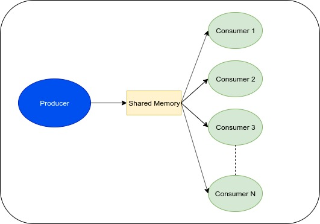

# Producer-Consumers
<p align="center">
  
</p>
<br />Solution to communication problem between 1 Producer and N Consumers.
A Master Process (Producer) forks N Child Processes (Consumers). The Producer creates locally a table of M random numbers (M > 3000) and the Consumers create an empty table of same size. The problem is that they must copy all the numbers in the Producer's table and place them in the same order inside their table, using a shared memory segment that can hold only 1 number. In the shared memory, other than the single number is contained a time stamp, in order to compute the copy latency for each consumer. Master and each Child Process write to results.txt file the numbers in table and Latency.

## Deployment

The code was developed and tested on **Linux Ubuntu 16.04 LTS** using **gcc v5.4.0**.

## Prerequisites

A Linux distribution is required with a gcc compiler order to compile and execute. _gcc v5.4.0_ or older is recommended.
<br />You can check your gcc compiler version using:
<br />``` $ gcc --version ```

You can install the latest gcc compiler on Ubuntu based systems using:
<br />``` $ sudo apt install build-essential ``` 

## Getting Started
Download Repository Locally using:
<br /> ```$ git clone https://github.com/AndCharalampous/producer-consumers.git ```

## Compilation
Compile code guiding in src directory and using the Makefile:
<br /> ```$ cd src```
<br /> ```$ make```
<br /> Executable file exe1 is created.

### Execution
Execute using:
<br /> ```$ ./exe1 N M```, where N: Number of Child Processes, M: Table size

### Results
Results in file results.txt created after execution.

## Author

**Andreas Charalampous** - https://github.com/AndCharalampous

## License

This project is licensed under the MIT License - see the [LICENSE.md](LICENSE.md) file for details
